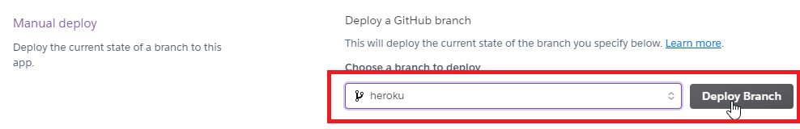

# 画像を Streamlit 上で表示して、imagenetの学習済みモデル(Pytorch)で分類

##### https://share.streamlit.io/riron1206/image_classification_streamlit_app/app.py にアプリデプロイしてる

- デプロイ方法参考: https://tech.ledge.co.jp/entry/2020/10/20/120000

-------------------------------------------------------------------------------------------------------------------------------

### heroku でデプロイ 

~~ライブラリ(pytorch)のサイズがでかいためか？heroku にデプロイはできなかった~~
~~heroku デプロイ時のエラーメッセージ: Compiled slug size: 1G is too large (max is 500M).~~

sourceのwhlファイルからpytorch install したらherokuでもデプロイできた

- **requirements_heroku.txt を使う必要がある。streamlit share との共存はできなかった…**

- heroku でデプロイするためのその他ファイル: setup.sh, Procfile

- heroku のデプロイ先: https://dashboard.heroku.com/apps/image-classification-streamlit/deploy/github

  - 「heroku」ブランチ指定したらデプロイできる

  

  - heroku でデプロイする方法参考: https://qiita.com/sho7650/items/ebd87c5dc2c4c7abb8f0

---------------------------------------------

##### References:
- https://github.com/jacobgil/pytorch-grad-cam

